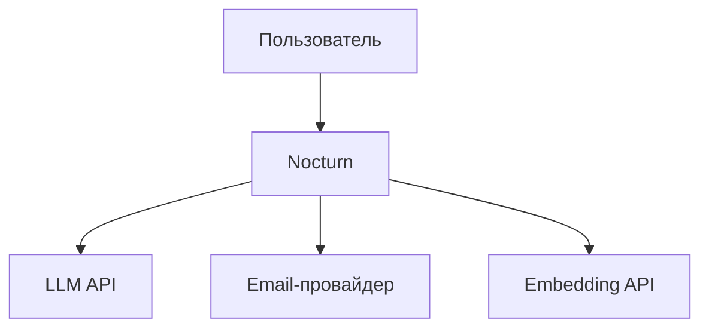

# Software Requirements Specification
## **Nocturn**
**Версия:** 1.3
**Дата:** 2026-04-19
**Автор:** Shamukhametov Ruslan

---
## Содержание

[[#1. Введение]]
[[#2. Общее описание системы]]
[[#3. Пользователи системы]]
[[#4. Функциональные требования]]
[[#5. Нефункциональные требования]]
[[#6. Ограничения и допущения]]
[[#7. Модель данных (концептуальная)]]
[[#8. Глоссарий]]

---
## 1. Введение

### 1.1 Цель документа

Данный документ описывает требования к системе Nocturn - сервису для создания, хранения и поиска личных заметок с применением AI-функций.
### 1.2 Область применения

Система предоставляет пользователям возможность:
- создавать и редактировать текстовые заметки
- организовывать заметки с помощью тегов (в текущей версии)
- взаимодействовать с базой знаний через AI-ассистента в чате: поиск заметок, одиночные и массовые (bulk) манипуляции с ними. Ассистент предлагает действия (proposals), пользователь применяет их через интерфейс
### 1.3 Контекст

Система является аналогом [Mem.ai](https://mem.ai). Основная инфраструктура (backend, БД, frontend) развёртывается на собственном сервере, однако система зависит от внешних сервисов: LLM API для AI-функций и email-провайдер для отправки писем.
### 1.4 Связанные документы

1. Software Architecture Document ([[SAD]])
2. Configuration & Policies Specification ([[CPS]])
3. Assistant Interface Specification ([[AIS]])

---

## 2. Общее описание системы

### 2.1 Контекст системы

### 2.2 Что система НЕ делает (явные исключения)

- Не работает offline
- Не создаёт автоматические связи между заметками
- Не имеет клиентского приложения (в текущей версии)
- Не обрабатывает файлы (PDF, изображения) - только текст
- Не имеет визуального поискового интерфейса — поиск заметок через UI выполняется только через AI-ассистента. Прямой API для поиска по ключевым словам доступен без участия ассистента (FR-NOTES-10). Фильтрация заметок по тегу доступна в UI без участия ассистента

---
## 3. Пользователи системы

### 3.1 Роли

| Роль    | Описание                                                              |
| ------- | --------------------------------------------------------------------- |
| `user`  | Зарегистрированный пользователь. Создаёт и управляет своими заметками |
| `admin` | Администратор. Управляет пользователями системы                       |
### 3.2 Создание первого администратора

При первом запуске системы должен быть автоматически создан администратор с заранее заданными учётными данными.
### 3.3 Характеристики пользователя

- Ведёт базу знаний объёмом до нескольких тысяч заметок
- Пишет заметки преимущественно на русском языке
- Использует AI-ассистента для поиска и манипуляций с заметками

---

## 4. Функциональные требования

> **Формат:** `FR-[модуль]-[номер]`  
> **Приоритеты:** Must (MVP) / Should (v1.1) / Could (backlog)

---
### 4.1 Модуль AUTH - Аутентификация

| ID          | Требование                                                                                                                                                                                                                                                                                                                                                  | Приоритет |
| :---------- | ----------------------------------------------------------------------------------------------------------------------------------------------------------------------------------------------------------------------------------------------------------------------------------------------------------------------------------------------------------- | --------- |
| FR-AUTH-01  | Пользователь может зарегистрироваться по email, паролю и никнейму                                                                                                                                                                                                                                                                                           | Must      |
| FR-AUTH-01a | Пароль должен соответствовать политике безопасности ([[CPS#1. Политика паролей]])                                                                                                                                                                                                                                                                           | Must      |
| FR-AUTH-01b | Никнейм должен содержать допустимые символы ([[CPS#2. Политика никнеймов]])                                                                                                                                                                                                                                                                                 | Must      |
| FR-AUTH-01c | Email должен быть валидным и уникальным в системе (независимо от регистра) ([[CPS#3. Валидация email]])                                                                                                                                                                                                                                                     | Must      |
| FR-AUTH-02  | После регистрации система отправляет письмо со ссылкой для подтверждения email. Ссылка действительна определённое время ([[CPS#5.1 Сессии и токены]]). До подтверждения пользователь не может войти в систему                                                                                                                                               | Must      |
| FR-AUTH-03  | Пользователь может войти по email и паролю (только после подтверждения email)                                                                                                                                                                                                                                                                               | Must      |
| FR-AUTH-04  | Система поддерживает сессии с автоматическим истечением ([[CPS#5.1 Сессии и токены]])                                                                                                                                                                                                                                                                       | Must      |
| FR-AUTH-05  | Пользователь может выйти из системы                                                                                                                                                                                                                                                                                                                         | Must      |
| FR-AUTH-06  | Заблокированный пользователь теряет доступ к системе (см. FR-ADMIN-02)                                                                                                                                                                                                                                                                                      | Should    |
| FR-AUTH-07  | Пользователь может сбросить пароль через email. Система отправляет письмо со ссылкой для сброса. Ссылка действительна определённое время ([[CPS#5.1 Сессии и токены]]). После успешного сброса все активные сессии аннулируются                                                                                                                             | Should    |
| FR-AUTH-08  | Пользователь может запросить повторную отправку письма подтверждения email. Предыдущая ссылка остаётся валидной до истечения                                                                                                                                                                                                                                | Should    |
| FR-AUTH-09  | При регистрации, сбросе пароля и повторной отправке подтверждения email возвращается одинаковый ответ вне зависимости от существования аккаунта с указанным email (защита от email enumeration)                                                                                                                                                             | Should    |
| FR-AUTH-10  | Одновременно допускается только один активный клиент на пользователя. При подключении второго клиента он переходит в режим read-only: доступен просмотр заметок и истории AI-чата, редактирование и отправка сообщений заблокированы. Пользователь может перенести активность на другой клиент (takeover), при этом предыдущий клиент переходит в read-only | Should    |
#### Сценарии ошибок AUTH

| Сценарий                                       | Поведение                                          |
| ---------------------------------------------- | -------------------------------------------------- |
| Попытка повторного использования ссылки        | Сервис отклоняет запрос. Каждая ссылка одноразовая |
| Сессия истекла или отозвана                    | Пользователь должен войти заново                   |
| Попытка мутирующей операции в read-only режиме | Система отклоняет запрос                           |

---

### 4.2 Модуль NOTES - Заметки

| ID           | Требование                                                                                                                                                                                                                          | Приоритет |
| :----------- | ----------------------------------------------------------------------------------------------------------------------------------------------------------------------------------------------------------------------------------- | --------- |
| FR-NOTES-01  | Пользователь может создать новую заметку. Заметка состоит из необязательного заголовка и текстового содержимого в формате Markdown. Оба поля могут быть пустыми                                                                     | Must      |
| FR-NOTES-02  | Редактор заметок поддерживает Markdown с пререндерингом. Поддерживаемые элементы: заголовки, списки, жирный/курсив, код, цитаты, горизонтальные линии, таблицы, ссылки. Изображения и другие нетекстовые элементы не поддерживаются | Must      |
| FR-NOTES-03  | Пользователь может редактировать существующую заметку                                                                                                                                                                               | Must      |
| FR-NOTES-04  | Заметка сохраняется автоматически при наличии изменений                                                                                                                                                                             | Must      |
| FR-NOTES-04a | Автосохранение приостанавливается при наличии необработанных proposals от AI-ассистента (см. FR-AI-12a). Это действительно только для заметок с proposals                                                                           | Should    |
| FR-NOTES-04b | Пользователь предупреждается о несохранённых изменениях при выходе из редактора                                                                                                                                                     | Should    |
| FR-NOTES-05  | Пользователь может удалить заметку. Удалённая заметка исчезает из списка, поиска и чата AI-ассистента, но может быть восстановлена                                                                                                  | Must      |
| FR-NOTES-05a | Пользователь может просматривать корзину удалённых заметок                                                                                                                                                                          | Should    |
| FR-NOTES-05b | Пользователь может восстановить заметку из корзины. Связи с тегами сохраняются, кроме тегов, удалённых за время нахождения заметки в корзине                                                                                        | Should    |
| FR-NOTES-05c | Пользователь может окончательно удалить заметку из корзины                                                                                                                                                                          | Should    |
| FR-NOTES-05d | Удалённые заметки автоматически удаляются окончательно через определённое время ([[CPS#5.2 Заметки]])                                                                                                                               | Should    |
| FR-NOTES-06  | Пользователь видит список своих заметок (заголовок + дата изменения), отсортированных по дате изменения, с пагинацией                                                                                                               | Must      |
| FR-NOTES-07  | Пользователь может назначить заметке один или несколько тегов (см. 4.3)                                                                                                                                                             | Must      |
| FR-NOTES-08  | Система отслеживает версию заметки (`version` поле). При сохранении клиент передаёт текущую версию заметки. Если версия на сервере отличается от переданной, сохранение отклоняется (optimistic locking)                             | Must      |
| FR-NOTES-09  | Система поддерживает пакетное получение нескольких заметок по массиву ID в одном запросе (используется клиентом для отображения diff в bulk proposals)                                                                              | Should    |
| FR-NOTES-10  | API поддерживает поиск активных заметок по ключевым словам с задаваемым лимитом результатов. Все ключевые слова должны присутствовать в заголовке или содержимом заметки (AND-логика). Поиск регистронезависим. Ответ включает список совпадений, общее число совпадений без учёта лимита и список применённых ключевых слов | Should    |

#### Сценарии ошибок NOTES

| Сценарий                                                                      | Поведение                                                                                                                                                                                    |
| ----------------------------------------------------------------------------- | -------------------------------------------------------------------------------------------------------------------------------------------------------------------------------------------- |
| Превышен лимит заметок ([[CPS#5.2 Заметки]])                                  | Система отклоняет создание. Существующие заметки не затрагиваются. Лимит считается по активным заметкам (вместе с soft-deleted)                                                              |
| Превышен лимит размера заметки ([[CPS#5.2 Заметки]])                          | Система отклоняет сохранение                                                                                                                                                                 |
| Превышена длина заголовка ([[CPS#5.2 Заметки]])                               | Система отклоняет сохранение                                                                                                                                                                 |
| Превышен лимит тегов на заметку ([[CPS#5.2 Заметки]])                         | Система отклоняет назначение тега. Существующие теги не затрагиваются                                                                                                                        |
| Недоступность embedding-сервиса при сохранении                                | Заметка сохраняется успешно. Генерация embedding помещается в очередь (см. FR-EMB-02)                                                                                                        |
| Попытка открыть несуществующую или soft-deleted заметку                       | Система возвращает ошибку "не найдено"                                                                                                                                                       |
| Попытка открыть чужую заметку                                                 | Система возвращает ошибку "не найдено"                                                                                                                                                       |
| Сеть недоступна при автосохранении                                            | Клиент отображает индикатор ошибки. Повторная попытка при следующем цикле автосохранения ([[CPS#5.2 Заметки]]) или при восстановлении соединения                                             |
| Конфликт версий при сохранении (FR-NOTES-08)                                  | Система отклоняет сохранение. Клиент предлагает обновить заметку                                                                                                                             |
| Попытка восстановить заметку с истёкшим сроком хранения ([[CPS#5.2 Заметки]]) | Система возвращает ошибку "не найдено"                                                                                                                                                       |
| Превышен лимит заметок                                                        | Система отклоняет создание. Лимит считается по активным заметкам вместе с soft-deleted, **чтобы исключить обход лимита через удаление заметок в корзину (корзина не лимитируется отдельно)** |

---
### 4.3 Модуль TAGS - Теги

| ID          | Требование                                                                                                                                                                                              | Приоритет |
| :---------- | ------------------------------------------------------------------------------------------------------------------------------------------------------------------------------------------------------- | --------- |
| FR-TAGS-01  | Пользователь может создать тег                                                                                                                                                                          | Must      |
| FR-TAGS-01a | Имя тега должно соответствовать политике именования ([[CPS#4. Политика тегов]]). Пробелы в начале и конце автоматически удаляются. Имя тега уникально в рамках одного пользователя (регистронезависимо) | Must      |
| FR-TAGS-02  | Пользователь может переименовать тег                                                                                                                                                                    | Must      |
| FR-TAGS-03  | Пользователь может удалить тег. При удалении тег отвязывается от всех заметок (включая soft-deleted); сами заметки не затрагиваются                                                                     | Must      |
| FR-TAGS-04  | Пользователь может фильтровать заметки по тегу в UI. При выборе тега список заметок отображает только заметки с выбранным тегом. Фильтрация выполняется без участия AI-ассистента                       | Should    |
| FR-TAGS-05  | Количество тегов на пользователя ограничено ([[CPS#4. Политика тегов]])                                                                                                                                 | Must      |

#### Сценарии ошибок TAGS

| Сценарий                                                  | Поведение                                                                                                |
| --------------------------------------------------------- | -------------------------------------------------------------------------------------------------------- |
| Превышен лимит тегов ([[CPS#4. Политика тегов]])                 | Система отклоняет создание                                                                               |
| Создание тега с дублирующимся именем (регистронезависимо) | Система отклоняет создание                                                                               |
| Переименование тега в уже существующее имя                | Система отклоняет переименование                                                                         |
| Удаление тега, привязанного к заметкам                    | Клиент показывает диалог подтверждения. При подтверждении - тег отвязывается от всех заметок и удаляется |
| Имя тега не проходит валидацию ([[CPS#4. Политика тегов]])        | Система отклоняет запрос                                                                                 |
| Попытка операции с несуществующим или чужим тегом          | Система возвращает ошибку "не найдено"                                                                   |

---
### 4.4 Модуль EMB - Embeddings

| ID        | Требование                                                                                                                                                                                    | Приоритет |
| :-------- | --------------------------------------------------------------------------------------------------------------------------------------------------------------------------------------------- | --------- |
| FR-EMB-01 | При создании или изменении заметки система автоматически генерирует embedding для семантического поиска. Создание и редактирование заметки не блокируется процессом генерации                 | Must      |
| FR-EMB-02 | При недоступности embedding-сервиса задача помещается в очередь. В очереди хранится не более одной задачи на заметку. Повторное редактирование заметки заменяет существующую задачу в очереди | Should    |
| FR-EMB-03 | После исчерпания попыток обработки ([[CPS#5.4 Очередь embedding]]) задача переводится в статус failed. Администратор может отслеживать failed-задачи                                                    | Should    |

---

### 4.5 Модуль AI - AI-ассистент

Детальная спецификация ассистента (архитектура, tools, API-контракты, стриминг, обработка ошибок) описана в AIS.
#### Принцип работы

Ассистент не имеет прямого write-доступа к заметкам. Все мутации выполняются через стандартные эндпоинты модуля NOTES после явного подтверждения пользователем.

| ID        | Требование                                                                                                                                                                                                                                                                                                             | Приоритет |
| :-------- | ---------------------------------------------------------------------------------------------------------------------------------------------------------------------------------------------------------------------------------------------------------------------------------------------------------------------- | --------- |
| FR-AI-01  | Пользователь может задать вопрос в чате и получить ответ на основе своих заметок                                                                                                                                                                                                                                       | Must      |
| FR-AI-02  | Система отображает источники (ссылки на заметки), использованные для ответа ([[CPS#5.3 AI-ассистент]])                                                                                                                                                                                                                 | Must      |
| FR-AI-03  | Чат поддерживает историю сообщений в рамках сессии. Сессия - непрерывный диалог, завершающийся по действию пользователя «новый чат». История хранится на сервере                                                                                                                                                       | Must      |
| FR-AI-03a | Заголовок чат-сессии автоматически формируется из первых 100 символов первого сообщения пользователя. До первого сообщения заголовок отсутствует                                                                                                                                                                        | Should    |
| FR-AI-03b | Пользователь может переименовать чат-сессию вручную                                                                                                                                                                                                                                                                    | Should    |
| FR-AI-04  | Чат не имеет доступа к заметкам других пользователей                                                                                                                                                                                                                                                                   | Must      |
| FR-AI-05  | При недоступности LLM API чат отображает сообщение об ошибке                                                                                                                                                                                                                                                           | Must      |
| FR-AI-06  | Ответ ассистента стримится, не ожидая полной генерации                                                                                                                                                                                                                                                                 | Must      |
| FR-AI-07  | Чат-сессии автоматически удаляются по истечении срока хранения ([[CPS#5.3 AI-ассистент]])                                                                                                                                                                                                                              | Should    |
| FR-AI-08  | Пользователь может удалить чат-сессию вручную вместе со всей историей                                                                                                                                                                                                                                                  | Should    |
| FR-AI-09  | Длина сообщения пользователя ограничена ([[CPS#5.3 AI-ассистент]])                                                                                                                                                                                                                                                     | Must      |
| FR-AI-10  | Пользователь не может отправить новое сообщение, пока генерируется ответ или имеются необработанные proposals                                                                                                                                                                                                          | Must      |
| FR-AI-11  | Пользователь может прикрепить к сообщению до 5 заметок ([[CPS#5.3 AI-ассистент]]). Клиент передаёт массив UUID. Бэкенд резолвит заметки (проверяет существование, принадлежность, не soft-deleted), невалидные UUID игнорируются. Заголовок и превью прикреплённых заметок передаются в контекст LLM. Если ассистенту нужен полный контент — он вызывает `get_note` | Should    |
| FR-AI-12  | Ассистент может предлагать действия с заметками (proposals). Типы: создание, редактирование, удаление заметки, добавление и удаление тегов. Proposal отображается как интерактивный элемент с возможностью применить или отклонить. При наличии нескольких proposals доступны кнопки «Применить всё» / «Отклонить всё» | Must      |
| FR-AI-12a | Пока у пользователя есть необработанные proposals, автосохранение редактора приостанавливается                                                                                                                                                                                                                         | Should    |
| FR-AI-12b | Не более одного proposal каждого типа на одну заметку в одном ответе                                                                                                                                                                                                                                                   | Should    |
| FR-AI-13  | Ассистент поддерживает массовые (bulk) операции над несколькими заметками ([[CPS#5.3 AI-ассистент]]). Bulk-операция требует предварительного подтверждения пользователем. После подтверждения система генерирует proposals, которые пользователь применяет или отклоняет                                               | Should    |
| FR-AI-13a | Не более одной bulk-операции в одном ответе. Если запрос требует несколько - ассистент выполняет первую и предлагает пользователю отправить отдельный запрос                                                                                                                                                           | Should    |
| FR-AI-13b | Пользователь может остановить выполняющуюся bulk-операцию. Уже сгенерированные proposals сохраняются                                                                                                                                                                                                                   | Should    |
| FR-AI-14  | Количество чат-сессий на пользователя ограничено ([[CPS#5.3 AI-ассистент]])                                                                                                                                                                                                                                            | Should    |

#### Сценарии ошибок AI

| Сценарий                                               | Поведение                                                                                                      |
| ------------------------------------------------------ | -------------------------------------------------------------------------------------------------------------- |
| LLM API недоступен                                     | Чат отображает ошибку. Предыдущие сообщения сохраняются                                                        |
| Таймаут LLM API ([[CPS#5.3 AI-ассистент]])             | Система прерывает запрос. Сообщение пользователя сохраняется, ответ ассистента - нет                           |
| Превышена длина сообщения ([[CPS#5.3 AI-ассистент]])   | Система отклоняет отправку                                                                                     |
| У пользователя нет заметок                             | Чат работает, ассистент сообщает что заметок не найдено                                                        |
| Embedding-сервис недоступен                            | Ассистент использует доступные инструменты поиска. Если результатов нет - отвечает на основе контекста диалога |
| Попытка отправки в несуществующую или чужую сессию     | Система возвращает ошибку "не найдено"                                                                         |
| Отправка во время генерации ответа                     | Система отклоняет запрос                                                                                       |
| Превышен rate limit ([[CPS#6. Rate limiting]])         | Система отклоняет запрос с предложением подождать                                                              |
| Применение proposal к удалённой или изменённой заметке | Стандартные ошибки модуля NOTES                                                                                |
| Применение proposal при исчерпанном лимите заметок     | Стандартная ошибка лимита модуля NOTES                                                                         |
| Переход по ссылке на удалённую заметку из sources      | Клиент отображает заглушку                                                                                     |
| Превышен лимит чат-сессий ([[CPS#5.3 AI-ассистент]])   | Система отклоняет создание с предложением удалить старые                                                       |
| Отмена bulk-операции                                   | Обработка прекращается, уже сгенерированные proposals сохраняются                                              |

---
### 4.6 Модуль ADMIN - Администрирование

| ID          | Требование                                                                                                                          | Приоритет |
| :---------- | ----------------------------------------------------------------------------------------------------------------------------------- | --------- |
| FR-ADMIN-01 | Администратор может просматривать список всех пользователей системы                                                                 | Must      |
| FR-ADMIN-02 | Администратор может блокировать и разблокировать аккаунт пользователя (см. FR-AUTH-06)                                              | Should    |
| FR-ADMIN-03 | Администратор может удалить пользователя со всеми связанными данными (каскадное удаление)                                           | Should    |
| FR-ADMIN-04 | Администратор может редактировать никнейм пользователя                                                                              | Could     |
| FR-ADMIN-05 | Администратор может просматривать системную статистику: общее количество пользователей, заметок и failed-задач в очереди embeddings | Should    |
| FR-ADMIN-06 | Администратор не имеет доступа к содержимому заметок пользователей                                                                  | Must      |
| FR-ADMIN-07 | Администратор не может заблокировать, удалить или понизить в правах свой собственный аккаунт                                        | Should    |
#### Сценарии ошибок ADMIN

| Сценарий                                                  | Поведение                                                      |
| --------------------------------------------------------- | -------------------------------------------------------------- |
| Администратор пытается заблокировать или удалить сам себя | Система отклоняет запрос (FR-ADMIN-07)                         |
| Блокировка уже заблокированного пользователя              | Система возвращает текущий статус без изменений (идемпотентно) |
| Операция с несуществующим пользователем                   | Система возвращает ошибку "не найдено"                         |

### 4.7 Модуль PROFILE - Управление профилем

| ID            | Требование                                                                                                                                                                                                 | Приоритет |
| :------------ | ---------------------------------------------------------------------------------------------------------------------------------------------------------------------------------------------------------- | --------- |
| FR-PROFILE-01 | Пользователь может изменить свой пароль, указав текущий и новый пароль. Новый пароль проходит валидацию ([[CPS#1. Политика паролей]]). После смены пароля все активные сессии, кроме текущей, аннулируются | Should    |
| FR-PROFILE-02 | Пользователь может изменить свой никнейм. Новый никнейм проходит валидацию ([[CPS#2. Политика никнеймов]])                                                                                                 | Should    |
| FR-PROFILE-03 | Пользователь может просматривать информацию своего профиля: email, никнейм, дату регистрации                                                                                                               | Must      |
#### Сценарии ошибок PROFILE

| Сценарий                                                         | Поведение                |
| ---------------------------------------------------------------- | ------------------------ |
| Неверный текущий пароль                                          | Система отклоняет запрос |
| Новый пароль не проходит валидацию ([[CPS#1. Политика паролей]]) | Система отклоняет запрос |
| Никнейм не проходит валидацию ([[CPS#2. Политика никнеймов]])    | Система отклоняет запрос |

---
## 5. Нефункциональные требования

### 5.1 Производительность

| ID          | Требование                                                                                                                                              |
| :---------- | ------------------------------------------------------------------------------------------------------------------------------------------------------- |
| NFR-PERF-01 | Страница загружается в пределах допустимого времени ([[CPS#7. Производительность]])                                                                     |
| NFR-PERF-02 | API отвечает в пределах допустимого времени для CRUD-операций без AI ([[CPS#7. Производительность]])                                                    |
| NFR-PERF-03 | Время внутреннего поиска (полнотекстового и семантического) не превышает допустимого порога при расчётном объёме данных ([[CPS#7. Производительность]]) |
| NFR-PERF-04 | Первый токен ответа AI-ассистента получен в пределах допустимого таймаута ([[CPS#7. Производительность]])                                               |
### 5.2 Безопасность

| ID         | Требование                                                                                                                                                                      |
| :--------- | ------------------------------------------------------------------------------------------------------------------------------------------------------------------------------- |
| NFR-SEC-01 | Все запросы к защищённым эндпоинтам требуют авторизацию. Публичные эндпоинты (регистрация, вход, подтверждение email, сброс пароля, обновление токена) доступны без авторизации |
| NFR-SEC-02 | Пароли хранятся в хешированном виде                                                                                                                                             |
| NFR-SEC-03 | Соединение с сервером только по HTTPS                                                                                                                                           |
| NFR-SEC-04 | Данные одного пользователя изолированы от данных другого                                                                                                                        |
| NFR-SEC-05 | Rate limiting применяется ко всем эндпоинтам ([[CPS#6. Rate limiting]])                                                                                                                |
| NFR-SEC-06 | Markdown-контент санитайзится при сохранении и при рендеринге для защиты от XSS                                                                                                 |
| NFR-SEC-07 | Backend ограничивает CORS только доменом frontend-приложения                                                                                                                    |

### 5.3 Надёжность

| ID         | Требование                                                                                                                                    |
| :--------- | --------------------------------------------------------------------------------------------------------------------------------------------- |
| NFR-REL-01 | При сбое LLM API система деградирует gracefully - AI-функции недоступны, остальные работают                                                   |
| NFR-REL-02 | При сбое embedding-сервиса создание и редактирование заметок не блокируется                                                                   |
| NFR-REL-03 | При недоступности Redis мутирующие операции (создание, редактирование, удаление) возвращают ошибку. Операции чтения работают без ограничений. |
### 5.4 Очистка устаревших данных

| ID           | Требование                                                                                                                    |
| :----------- | ----------------------------------------------------------------------------------------------------------------------------- |
| NFR-CLEAN-01 | Неподтверждённые аккаунты удаляются автоматически по истечении срока ([[CPS#5.1 Сессии и токены]])                                    |
| NFR-CLEAN-02 | Истёкшие токены и ссылки удаляются из БД автоматически                                                                        |
| NFR-CLEAN-03 | Чат-сессии удаляются автоматически по истечении срока ([[CPS#5.3 AI-ассистент]])                                                   |
| NFR-CLEAN-04 | Soft-deleted заметки окончательно удаляются по истечении срока ([[CPS#5.2 Заметки]]) с каскадным удалением связанных данных   |
### 5.5 Масштабируемость

| ID           | Требование                                                                                                                                                                                                               |
| :----------- | ------------------------------------------------------------------------------------------------------------------------------------------------------------------------------------------------------------------------ |
| NFR-SCALE-01 | Система рассчитана на ограниченное количество пользователей и заметок ([[CPS#8. Масштабирование]])                                                                                                                       |
| NFR-SCALE-02 | Backend не хранит пользовательское состояние в памяти процесса. SSE-ответы (стриминг AI) открываются per-request и привязаны к конкретному инстансу на время генерации; при горизонтальном масштабировании требуется sticky sessions или переподключение клиента. |
### 5.6 Развёртывание

| ID            | Требование                                                                                   |
| :------------ | -------------------------------------------------------------------------------------------- |
| NFR-DEPLOY-01 | Система запускается одной командой                                                           |
| NFR-DEPLOY-02 | Конфигурация задаётся через переменные окружения                                             |
| NFR-DEPLOY-03 | При первом запуске система автоматически применяет миграции БД и создаёт администратора       |
### 5.7 Логирование

| ID         | Требование                                                                                    |
| :--------- | --------------------------------------------------------------------------------------------- |
| NFR-LOG-01 | Система логирует ошибки и ключевые события (аутентификация, запросы к LLM API, сбои)          |
### 5.8 Резервное копирование

| ID            | Требование                                                                      |
| :------------ | ------------------------------------------------------------------------------- |
| NFR-BACKUP-01 | Резервное копирование и восстановление выполняется стандартными средствами СУБД |

### 5.9 Тестирование

| ID            | Требование                                                                                                                                                                                                    |
| :------------ | ------------------------------------------------------------------------------------------------------------------------------------------------------------------------------------------------------------- |
| NFR-TEST-01   | Unit-тесты покрывают бизнес-логику: валидации, optimistic locking, формирование контекста LLM, chunking, шаблоны summary                                                                                    |
| NFR-TEST-02   | Integration-тесты покрывают API-эндпоинты с реальной БД: CRUD-операции, аутентификацию, авторизацию, rate limiting, сценарии ошибок                                                                          |
| NFR-TEST-03   | E2E-тесты браузерного уровня не входят в скоуп. Один разработчик, высокая стоимость поддержки, низкий ROI при 25 пользователях                                                                              |

---

## 6. Ограничения и допущения

### 6.1 Ограничения

- Система зависит от внешних сервисов: LLM API и Embedding API для AI-функций и email-провайдер для отправки писем. При недоступности LLM - AI-функции недоступны; при недоступности email - регистрация и сброс пароля невозможны; при недоступности Embedding API - векторизация текста недоступна
- Мобильное приложение не входит в текущий скоуп
- Одновременная работа с нескольких клиентов ограничена: активен только один клиент, остальные работают в read-only режиме (см. FR-AUTH-10)
- Система зависит от Redis для мутирующих операций. При недоступности Redis операции записи недоступны (см. NFR-REL-03)
- При блокировке пользователя доступ может сохраняться в течение короткого времени до истечения текущей сессии
- Массовые (bulk) операции ограничены количеством заметок за один запрос ([[CPS#5.3 AI-ассистент]]). При необходимости обработать больше - потребуется несколько последовательных операций
- Смена embedding-модели требует пересчёта всех векторов
### 6.2 Допущения

- Пользователи имеют стабильное интернет-соединение
- Смена LLM-провайдера требует только обновления конфигурации (API-ключ и эндпоинт)
- Смена Embedding-провайдера требует только обновления конфигурации (API-ключ и эндпоинт)
- Email-сервис настроен и доступен; конфигурация задаётся через переменные окружения

---

## 7. Модель данных (концептуальная)

| Сущность     | Описание                                     | Связи                                                         |
| ------------ | -------------------------------------------- | ------------------------------------------------------------- |
| Пользователь | Аккаунт с ролью (user/admin)                 | Владеет заметками, тегами, чат-сессиями                       |
| Заметка      | Текстовый документ в формате Markdown        | Принадлежит пользователю, имеет теги (M:N)                    |
| Тег          | Метка для категоризации заметок              | Принадлежит пользователю, связан с заметками (M:N)            |
| Чат-сессия   | Диалог с AI-ассистентом                      | Принадлежит пользователю, содержит сообщения                  |
| Сообщение    | Единица диалога (пользователь или ассистент) | Принадлежит чат-сессии, может содержать proposals и прикреплённые заметки |

При удалении пользователя каскадно удаляются все связанные данные. Заметки поддерживают soft delete с автоматическим окончательным удалением ([[CPS#5.2 Заметки]]).

---
## 8. Глоссарий

| Термин        | Определение                                                                                                 |
| ------------- | ----------------------------------------------------------------------------------------------------------- |
| Заметка       | Текстовый документ, созданный пользователем                                                                 |
| Тег           | Метка, присваиваемая заметке для категоризации                                                              |
| Markdown      | Формат разметки текста, используемый для содержимого заметок                                                |
| Embedding     | Векторное представление текста для семантического поиска                                                    |
| RAG           | Retrieval-Augmented Generation - генерация ответов с поиском по базе знаний                                 |
| LLM           | Large Language Model - большая языковая модель                                                              |
| Soft delete   | Логическое удаление: данные помечаются как удалённые, но физически сохраняются до истечения срока ([[CPS]]) |
| Proposal      | Предложение ассистента выполнить действие с заметкой. Пользователь применяет или отклоняет через интерфейс  |
| Bulk-операция | Массовая операция над несколькими заметками, требующая подтверждения пользователем                          |

---

*Документ подлежит обновлению при изменении требований. Версия фиксируется при каждом изменении.*
